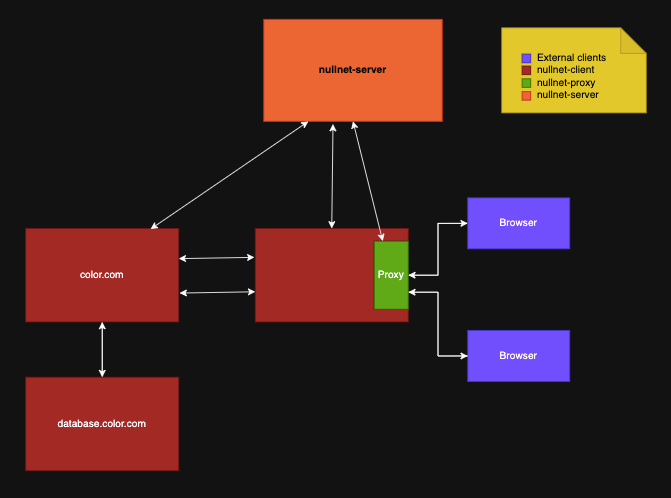

# NullNet: architecture overview

Most networks are set up so that machines are connected together and, by default, **everything can talk to everything**. 
A firewall is then typically layered on top to restrict what's allowed. 
The attack surface starts as the entire network, and shrinks only as far as the configured firewall rules manage to carve it down.

NullNet flips the logic around.  
By default, **nothing can talk to anything**: a service on one machine cannot reach a service on another until the moment it genuinely needs to.  
The connection is built right then, just for that one conversation, and it's torn down once not needed anymore.  
There is no pre-built network sitting there waiting to be attacked, because there is no pre-built network at all.

NullNet architecture is made of three components that coordinate over a gRPC control plane:

- **nullnet-proxy** — the ingress edge, the front door for traffic coming in from outside. Requests arrive here looking for a named service, and the proxy asks the server to build whatever connection is needed to deliver the request.
- **nullnet-server** — the brain, and the only piece that sees the whole picture. It holds a configurable topology of which services are allowed to talk to which, and it decides when to build each connection.
- **nullnet-client** — runs on each machine. It announces the services currently active on the local machine, and it watches for any of those services trying to reach another. The first time it sees that happening, it briefly pauses the request, asks the server to build the path, and then lets the request continue once the path exists.

Each time a service is requested — through the proxy or by another service — the server walks the whole chain that request will travel.  
If service A needs B, and B in turn needs C, that one request opens every link along the way at the same time, so the full path is ready atomically.  
Each link is a dedicated VXLAN tunnel, private between the two machines, and only stays open while it's being used; once detected as idle via a configurable timeout, the server tears it down.

The result: there is no broad "internal network" for an attacker to roam around inside if they break in somewhere. 
The only paths that exist are the narrow, temporary ones carrying legitimate traffic as determined by the current network activity and defined topology.  

